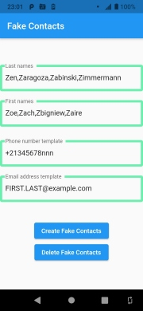

# Fake Contacts

Android phone app that creates fake contacts, which will be stored on your smartphone along with your real contacts.  This feeds fake data to any apps or companies who are copying our private data to use or sell it.  This is called "data-poisoning".

Nothing about these fake contacts will interfere with your normal use of your phone or your real contacts.

The app is available through F-Droid.

This is a sister-application to "Fake Contacts 2", which puts fake information in some fields of all contacts.

## Functionality
The user can set lists of last names and first names for fake contacts, and phone-number and email-address templates for them.  Then click buttons to create or delete fake contacts with all combinations of the first and last names.


## Use



The default values should be sensible.  All of the first and last names start with "Z", to try to keep them from colliding with names of real contacts, and to keep them out of the way (at the end of the Contacts list).

So, just install and launch the application, and click the "Create Fake Contacts" button.  The system should ask you to grant Contacts permission to the application.  Then the contacts (one for each firstname-lastname combination) will be created.  Launch your usual Contacts app and scroll to the end to see the new contacts.  Note: it may take a couple of minutes to update the list.

If you wish, click the "Delete Fake Contacts" button to delete them.  Note: it may take a couple of minutes to update the list.  You also could use your normal Contacts app to delete them manually at any time, without causing any problem.

You could uninstall this app after creating the fake contacts, without causing any problem.


### Customizing

* The list of last names is just a comma-separated list.  You can edit it to have any names.  Best not to have any spaces.

* The list of first names is similar.

* The phone-number template is a single value used for all contacts.  Any character "n" in it will be replaced by a digit 0-9, derived from the contact's last name.  The default format is ```+2134567nnnn```, which is intended to use an unassigned country code "21".  You could delete the contents of this field if you wish, and no phone numbers will be generated.

* The email-address template is a single value used for all contacts.  Any string "FIRST" in it will be replaced by the contact's first name.  Any string "LAST" in it will be replaced by the contact's last name.  The default format is ```FIRST.LAST@example.com```, which is intended to be an unused email domain.  You could delete the contents of this field if you wish, and no email addresses will be generated.


### Quirks

* The app is designed to be very simple and fail silently.  If you deny permission to access contacts, the app will not complain, it just will not work.  If you click the "Create" button multiple times, you just get one set of fake contacts.  If you click the "Delete" button and the specified contacts don't exist, nothing is done, and no error message is shown.

* Don't create any fake contact with the same full name as one of your real contacts.  If you delete fake contacts, the real one with same name will be deleted too.

* Replacements for "n" digits in phone numbers are calculated deterministicly (repeatably) from contact's last name.  So for example if 5 users of this app all just leave everything set at defaults, the same contacts will show up on each of their phones with the same names, phone numbers, and email addresses.  This is good, for data-poisoning purposes.  Further, all fake contacts with same last name will have same phone number (debatable whether this is good or bad).


---


## Releases
### 1.0.0
Got working.
### 1.6.0
Got published on F-Droid.
### 1.7.0
Changed color of delete button, added space between buttons, added a lot more names, cleaned up the code a little.
### 1.8.0
Added Spanish description to Fastlane per https://github.com/BillDietrich/fake_contacts/pull/5


---

## Development
### To-Do list
* What Android versions are supported ?  I tested on 9; someone else says it works on 9 and crashes on 5.
* Add buttons to add/delete fake secondary info (e.g. birthday ?) on ALL contacts. Or make a separate app for that.
* Want to explicitly set Notification permission off, but there's no way to do it.
* No UI feedback after create and delete operations.
* Add photos from thispersondoesnotexist.com ?
* Page doesn't scroll if screen is too short.
* Inefficiency in the "save settings after every char changed in field" events.
* Test on iOS.

### Development Environment
I'm no expert on this stuff, this is my first phone app, maybe I'm doing some things stupidly.

Now using:
* Android Studio
* Flutter
* Dart
* Linux
* Phone running Android 9

[F-Droid page for this app](https://fdroid.gitlab.io/fdroid-website/en/packages/me.billdietrich.fake_contacts/)

[GitHub repo for this app](https://github.com/BillDietrich/fake_contacts)

[My web site](https://www.billdietrich.me/)


---

## Privacy Policy
This application doesn't collect, store or transmit your identity or personal information in any way.  It contains no advertising and no trackers.


## License

See LICENSE.md file.  MIT license.  Copyright 2021 Bill Dietrich.
