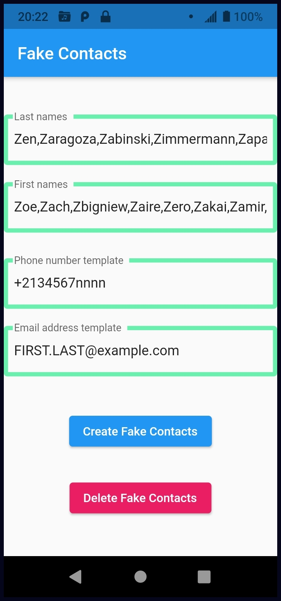

# fake_contacts

Create fake phone contacts.

The idea is to create a lot of fake contacts in your phone, feeding bad data to any apps or companies who are copying your private data to use or sell it.  This is called "data-poisoning".

[IN PROTOTYPING STAGE; NOT DANGEROUS, BUT NOT READY FOR USE !!!]


## Functionality
The user can set lists of last names and first names for fake contacts, and phone-number and email-address templates for them.  Then click buttons to create or delete all those contacts.


## Use

The default values should be sensible.  All of the first and last names start with "Z", to try to keep them from interfering with your real contacts, and to keep them out of the way (at the end of the Contacts list).

So, just install and launch the application, and click the "Create All Contacts" button.  The system should ask you to grant Contacts permission to the application.  Then the contacts (one for each firstname-lastname combination) will be created.  Launch your usual Contacts app and scroll to the end to see the new contacts.

If you wish, click the "Delete All Fake Contacts" button to delete them.




### Customizing

* The list of last names is just a comma-separated list.  You can edit it to have any names.  Best not to have any spaces.

* The list of first names is similar.

* The phone-number template is a single value used for all contacts.  Any character "n" in it will be replaced by a random digit 0-9.  The default format is ```+21345678nnn```, which is intended to use an unassigned country code "21".  You could delete the contents of this field if you wish.

* The email-address template is a single value used for all contacts.  Any string "FIRST" in it will be replaced by the contact's first name.  Any string "LAST" in it will be replaced by the contact's last name.  The default format is ```FIRST.LAST@example.com```, which is intended to be an unused email domain.  You could delete the contents of this field if you wish.


### Quirks

* The app is designed to be very simple and fail silently.  If you deny permission to access contacts, the app will not complain, it will just not work.  If you click the "Create" button multiple times, you will get duplicate contacts (harmless).  If you click the "Delete" button and the specified contacts don't exist, nothing is done, and no error message is shown.


---


## Releases
### 1.0.0


---

## Development
### To-Do list
- Phone number and email address don't work yet.
* Settings are not stored persistently.
* Test on iOS.

### Development Environment
I'm no expert on this stuff, this is my first phone app, maybe I'm doing some things stupidly.

Now using:
* Android Studio
* Flutter
* Dart
* Linux

https://github.com/BillDietrich/fake_contacts.git

---

## Privacy Policy
This application doesn't collect, store or transmit your identity or personal information in any way.  It contains no advertising and no trackers.


## License

See LICENSE.md file.  MIT license.  Copyright 2021 Bill Dietrich.
